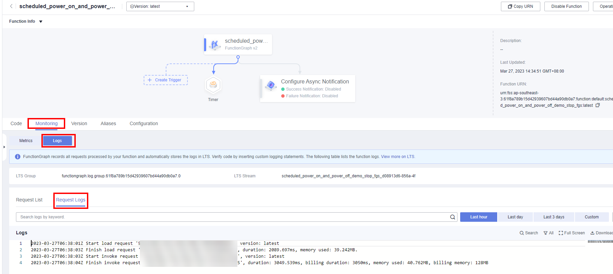

[TOC]

**Solution Overview**
===============
This solution uses a FunctionGraph timer trigger to periodically start and stop Elastic Cloud Servers (ECSs). You can stop unused ECSs, and later start them when needed to reduce operations costs.

For more details about this solution, visit: https://www.huaweicloud.com/intl/en-us/solution/implementations/secsss.html


**Architecture**
---------------


**Architecture Description**
---------------
This solution will:

1. Create two functions in FunctionGraph to call the ECS APIs for periodically starting and stopping ECSs.

2. Create a timer to periodically invoke the function code.

3. Create an agency in Identity and Access Management (IAM) to delegate FunctionGraph to access ECS in the relevant region.

**File Structure**
---------------

``` lua
huaweicloud-solution-scheduled-power-on-and-power-off-solution
├── scheduled-power-on-and-power-off-solution.tf.json -- Resource orchestration template
├── functiongraph
	├── batch-start-ecs-at-scheduled-time.py  -- Function file (startup)
	├── batch-stop-ecs-at-scheduled-time.py  -- Function file (shutdown)
```
**Getting Started**
---------------

1. Go to the [FunctionGraph console](https://console-intl.huaweicloud.com/functiongraph/?agencyId=f9a6de0674e84d4686ff806fc4eb78e8&region=ap-southeast-3&locale=en-us#/serverless/functionList), and view the created functions in the function list.

	Figure1 Created functions

	

2. On the details page of each function, view the created trigger.

	Figure2 Startup trigger

	

	Figure3 Shutdown trigger

	

3. On the Monitoring tab, check that each trigger started or stopped the specified ECSs at the specified time.

	Figure4 Request logs

	
